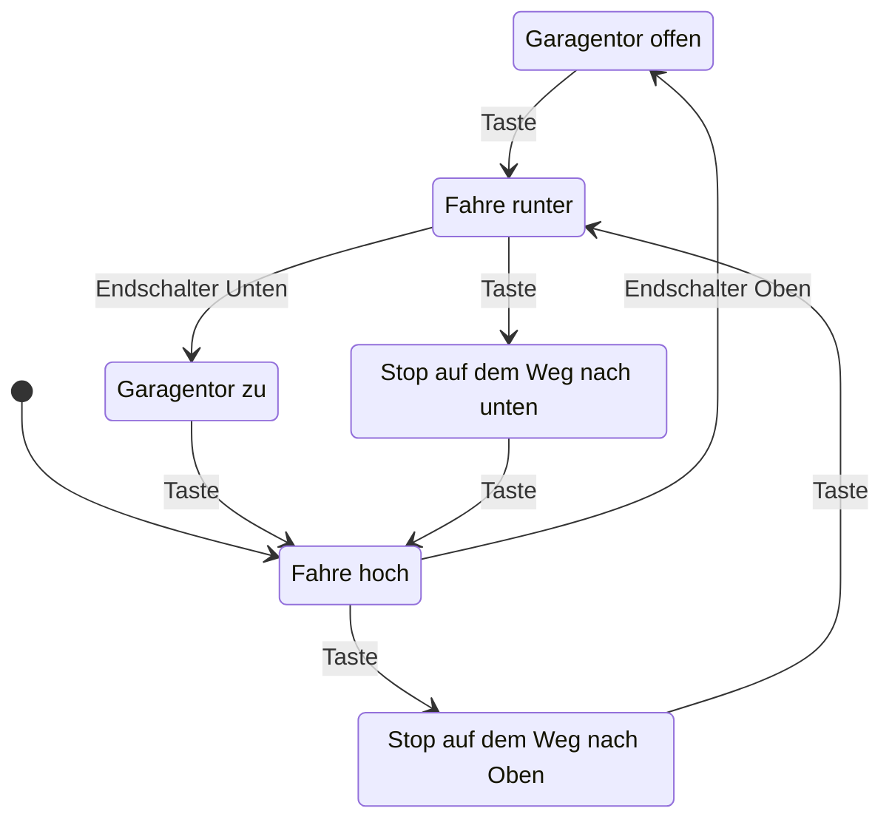

# Übungsaufgabe Nr. 5

Bevor Sie mit der Bearbeitung der ersten Übungsaufgabe starten wollen wir zunächst Ihre `git` Kenntnisse weiter vertiefen. In den letzten Vorlesung Terminen haben Sie das Konzept der verschiedenen remotes kennengelernt. Dies wollen wir nun vertiefen.

**WICHTIG:** Diese Übungsaufgabe soll einzeln und nicht in Gruppen erfolgen.

## Konfliktfrei

Aller Anfang ist schwer. Um sich das Leben nicht unnötig schwer zu machen sollten Sie den `main` Branch zunächst nicht ändern und jeweils immer nur die Änderungen aus dem allgemeinen Repository pullen. Das klare Ziel am Anfang ist es keine Konflikte zu provozieren.

**ACHTUNG:** Prüfen Sie ob `origin` Ihrer Projekt URL entspricht! In dieser darf `graugans` nicht auftauchen!

## Anlegen der Branches

Bevor Sie anfangen Quellcode zu schreiben erzeugen sie zunächst eine Kopie des Branches für die erste Übungsaufgabe. Zunächst müssen wir allerdings die lokale Kopie unseres Repository mit `upstream` und Ihrem `origin` synchronisieren.

```sh
git fetch --all
git switch -c solution-007 upstream/main
```

Sie können mit dem Kommando ``git branch -a`` prüfen ob dies erfolgreich war:

```sh
  main
* solution-007
  remotes/origin/HEAD -> origin/main
  remotes/origin/main
  remotes/upstream/main
```

Damit Sie nicht aus versehen in das falsche Repository pushen müssen Sie git mitteilen, dass Sie ab jetzt in Ihren fork pushen wollen:

```sh
git push --set-upstream origin solution-007
```

Nun haben Sie den branch `main` aus meinem Repository in Ihren Fork übertragen.

## Aufgabenstellung

Implementieren Sie einen Garagentorantrieb welcher über die folgende Sensorik verfügt:

- Endschalter oben/unten
- Fernbedienung mit einer Taste

## State Diagram

Based on a [mermaid diagram](https://mermaid.js.org/intro/).

